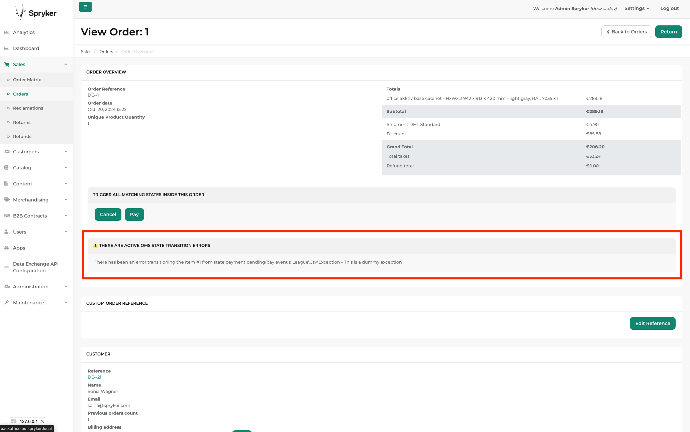

# Add failed oms transitions error notification in backoffice order detail (Spryker B2B Demo Shop)

This project is based on the Spryker B2B Demoshop, for the 2024 hackweek.
For any Spryker-related instructions, please refere to the original [Readme.md](https://github.com/victor-ufg/spryker-b2b-demo-oms-transition-errors/blob/main/README.md) file.

## Description

The purpose of this project is to enable a notification section in the order detail page, to inform shop managers that there is an active transition failure.

Until now, the failure of oms transitions has been handled by checking for exception errors. This might be undesired when the commerce team is not using New Relic or AWS, and makes detecting problems much faster/easier for non technical people.

## Current State

The module works and I consider it production ready. I didn't have time to add it to the order list (it was in my original intentions).

## Reusing this

The easiest way to integrate into your project, would be to run a diff between this repo and yours (or against the b2b demoshop, to get a clearer idea of what is changed). It should work with any demo shop, but you might have to align customizations/namespaces.

## Next Steps:

- [ ]  Provide information in the order list as well
- [ ]  Provide information in each of the order items and/or provide a hint about an error next to the stage
- [ ]  Use propel for generating the query?
- [ ]  Extract into an independent module and/or integrate with the original OMS/Sales modules.
